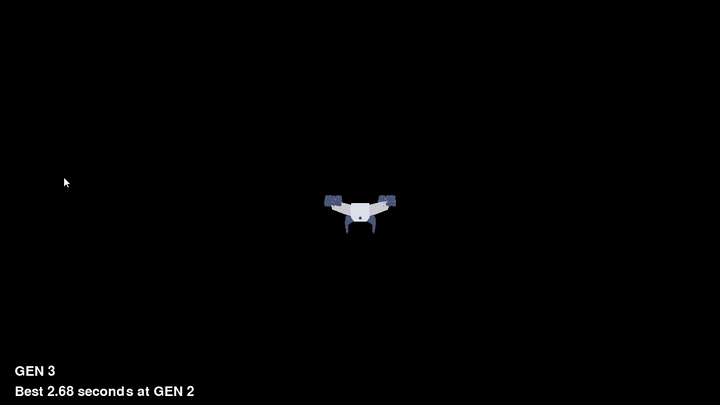
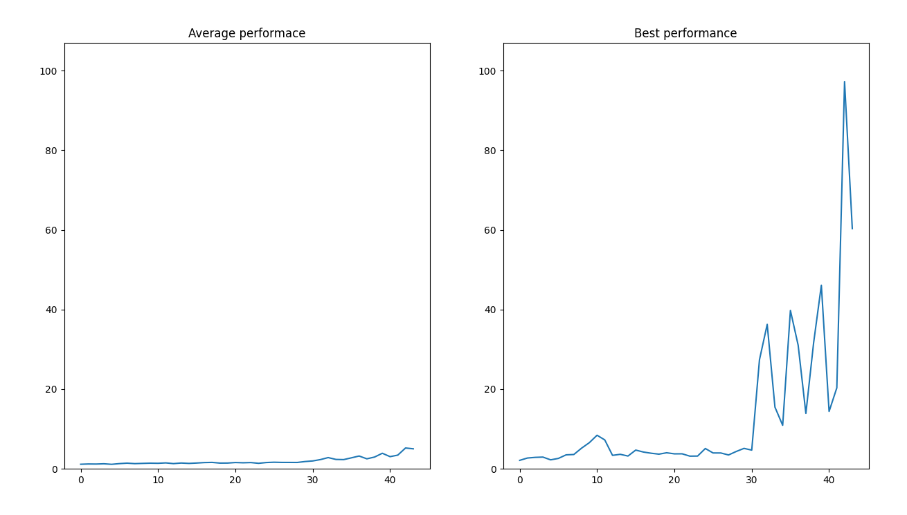

## Neural Network learning to pilot a drone

The Neural Network is learning how to pilot a drone and the goal is to stay alive for as long as possible (stays within the screen boundaries).

### How is it done?
Using genetic algorithm to alter neural network weights after some generations (kind of training?) we obtain a decent drone pilot. For example, under a specific configuration, genetic algorithm discoverd a set of weights (NN) that could pilot the drone for more than 90 seconds after only 10 mins of searching, piloting.

### This work
This is my way of implementing drone physics, movements, forces, neural networks (weights, links and forward pass), genetic algorithm for searching an optimal set of weights (NN).

## In action 

Feel free to check out the code, fork the repo and own it.